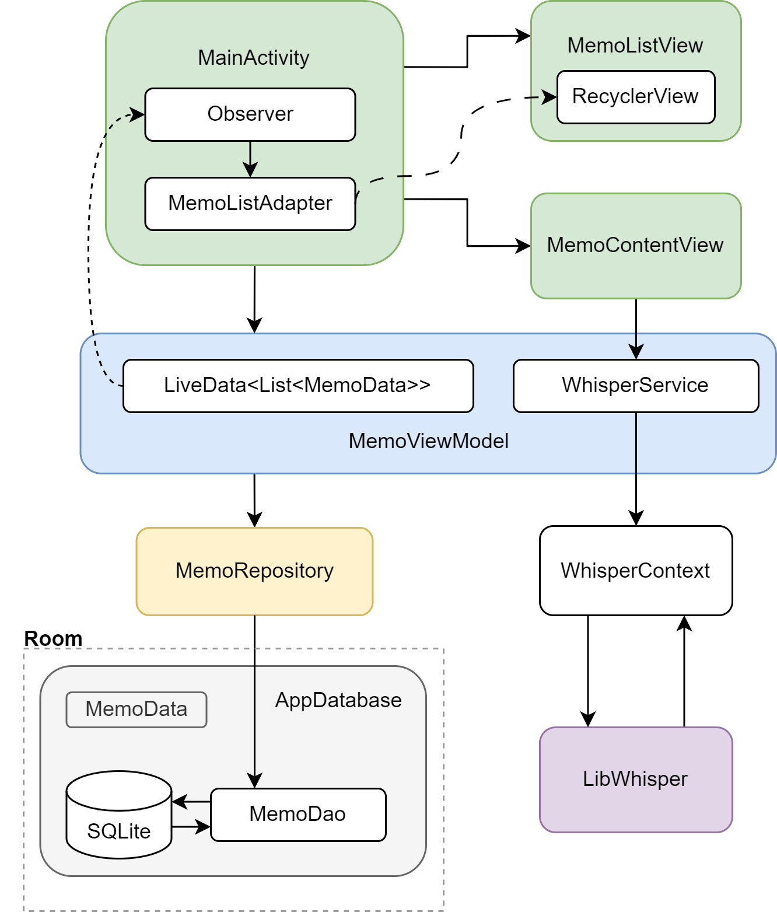

# MiniMemo

一个带语音转录的微型备忘录，能够储存文字记录信息，可添加/修改/搜索/删除条目，主要功能包括：

- 新建，编辑备忘录的文字内容，长按删除条目

- 搜索特定条目的包括标题在内的文字内容

- 分享备忘录内容

- 录音语音转录

## 软件架构

- 数据库储存实现基于[Room框架](https://developer.android.google.cn/training/data-storage/room?hl=zh-cn)

- 语音转文字实现基于[whisper.cpp](https://github.com/ggerganov/whisper.cpp/tree/master/examples/whisper.android.java)

## 环境配置

- Android Studio Koala Feature Drop 2024.1.2

- Java + Gradle 8.7

- NDK 27.2.12479018

- 应用运行环境 > Android 7.0(API 24)

# 参考

[whisper.cpp](https://github.com/ggerganov/whisper.cpp)

[Android Developer - 使用 RecyclerView 创建动态列表](https://developer.android.google.cn/develop/ui/views/layout/recyclerview?hl=zh-cn)

[Android Room with a View - Java](https://developer.android.google.cn/codelabs/android-room-with-a-view)